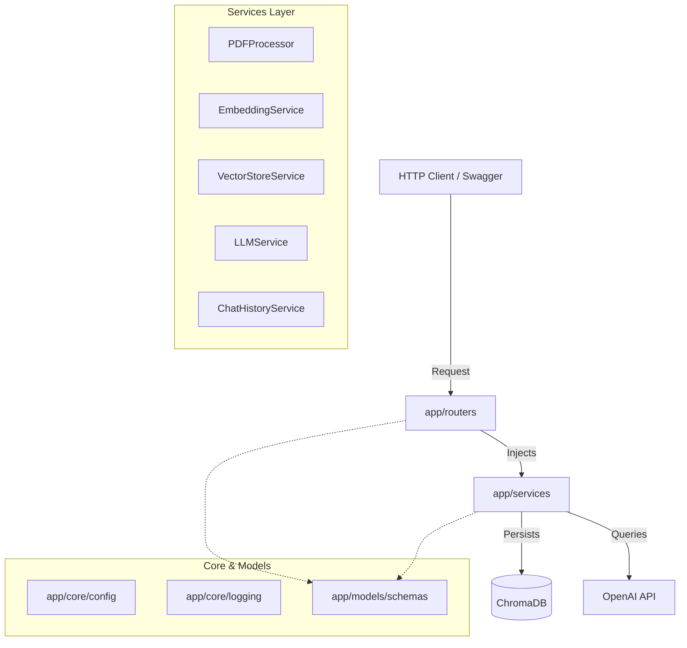

# AI Document Q&A Service (RAG)

A production-grade, Clean Architecture Retrieval-Augmented Generation (RAG) API built with **FastAPI**, **ChromaDB**, **OpenAI GPT-4o-mini / text-embedding-3-small**, **pdfplumber**, and **tiktoken**.

---

## 🛠️ Tech Stack
- **Framework**: FastAPI (Python 3.12)
- **Vector DB**: ChromaDB
- **Embedding Model**: `text-embedding-3-small` (1536 dimensions)
- **LLM**: `gpt-4o-mini` (configured via Structured Outputs JSON parser)
- **PDF Extraction**: `pdfplumber` (Page-aware extraction)
- **Tokenization**: `tiktoken` (`cl100k_base` encoding)
- **Validation**: Pydantic v2
- **Logging**: Loguru (with Request ID tracing context)
- **Containerization**: Docker & Docker Compose
- **Testing**: Pytest & Pytest-Cov
- **CI/CD**: GitHub Actions

---

## 📐 Architecture Overview

The system follows **Clean Architecture** principles. Layers are strictly decoupled, enforcing dependency injection and separation of concerns.



### Key Engineering Features
1. **Duplicate Detection**: Computes a SHA-256 hash of the uploaded document and blocks ingestion (HTTP 409 Conflict) if the file has already been parsed.
2. **Scanned PDF Detection**: Aborts ingestion (HTTP 422 Unprocessable Entity) if the average character count per page is `< 50`, warning that OCR is required.
3. **Multi-Document Searching**: Allows restricting search queries to specific files by passing an array of `document_ids`.
4. **Hallucination Prevention**: Enforces a pre-LLM similarity threshold cutoff (`0.55`). If retrieval similarity is poor, it halts reasoning and returns a clean "Not Found" response.
5. **Verbatim Citation Validation**: The backend validates that every text snippet cited by the LLM is a case-insensitive verbatim match in the retrieved document chunks.
6. **Log Correlation**: Request ID middleware generates context-bound UUIDs for logging every request trace and response latency.

---

## 📁 Folder Structure

```
├── app/
│   ├── api/            # API routing entry points
│   ├── core/           # Database, configs, exceptions, logging configurations
│   ├── middleware/     # Error handlers & request trace tracing middlewares
│   ├── models/         # Pydantic schemas (Request / Response validation)
│   ├── routers/        # Endpoint routers (/health, /documents, /qa)
│   ├── services/       # Core business logic handlers
│   └── main.py         # Application root setup
├── docs/               # Architecture design & prompt engineering docs
├── tests/              # Pytest unit, integration, and E2E endpoints suite
├── Dockerfile          # Multi-stage production container setup
├── docker-compose.yml  # Docker orchestration and persistence configuration
├── requirements.txt    # Application requirements
├── .env.example        # Environment variables structure template
└── README.md           # Setup & execution instructions
```

---

## 🚀 Getting Started

### Prerequisites
- Docker & Docker Compose
- Python 3.12 (if running locally without Docker)
- An OpenAI API Key

### Local Configuration
1. Clone the repository and navigate to the project directory.
2. Copy the environment variables:
   ```bash
   cp .env.example .env
   ```
3. Open `.env` and fill in your `OPENAI_API_KEY`:
   ```env
   OPENAI_API_KEY=your-actual-api-key-here
   ```

### Running with Docker (Recommended)
Build and run the API using Docker Compose:
```bash
docker-compose up --build
```
The API will start up on `http://localhost:8000`. Swagger documentation is available at `http://localhost:8000/docs`.

### Running Locally (Alternative)
1. Create and activate a virtual environment:
   ```bash
   python -m venv venv
   source venv/bin/activate  # On Windows: venv\Scripts\activate
   ```
2. Install dependencies:
   ```bash
   pip install -r requirements.txt
   ```
3. Run the development server:
   ```bash
   uvicorn app.main:app --reload
   ```

---

## 🧪 Running Tests

A comprehensive suite of unit, integration, and E2E API tests is provided under `/tests`.

Run tests with coverage tracking:
```bash
pytest --cov=app -v tests/
```
The test suite utilizes an in-memory ephemeral ChromaDB instance and AsyncOpenAI mock fixtures to run rapidly without making network requests.

---

## 📡 API Endpoints Summary

### System Endpoints
- **GET** `/health`: Verifies API status and runs a heartbeat check on ChromaDB.
- **GET** `/version`: Returns current software release and environment.

### Document Endpoints
- **POST** `/documents/upload`: Multi-part PDF uploader (MIME verified, file size validated, SHA-256 duplicate verified).
- **DELETE** `/documents/{document_id}`: Removes all parsed chunks and vector records for a file.

### Search & QA Endpoints
- **POST** `/search`: Performs semantic search and returns the top matching chunks with similarity scores.
- **POST** `/qa`: Grounded question answering (RAG) with session-based history matching and source citations.
